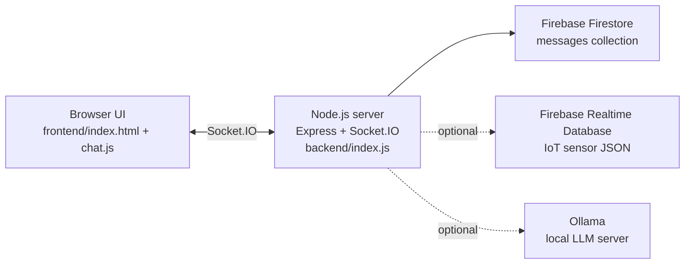

# ChimChat

ChimChat is a small real-time group chat app for local development and demos. It combines Socket.IO messaging with message persistence in Firebase Firestore, and optional AI commands backed by a local Ollama instance.


## Key Features

- Real-time group chat using Socket.IO
- Message persistence in Firebase Firestore (server loads last 10 messages on connect)
- Username stored in browser localStorage
- AI commands handled by the server (Ollama): `/summarize`, `/question <text>`, `/environment` (optional)
- Client-side toxicity filtering (TensorFlow.js toxicity model; toxic messages are replaced with `*****` before sending)
- “AI is typing…” indicator during AI command processing

## System Overview

### Architecture



### Components and responsibilities

- **Frontend (static files):** Renders the chat UI, stores the user’s display name in localStorage, performs client-side toxicity screening, and talks to the backend over Socket.IO.
- **Backend (Node.js):** Serves static frontend assets, accepts Socket.IO chat events, writes/reads messages in Firestore, and runs AI command handlers by calling Ollama.
- **Firebase Firestore:** Stores chat messages in a `messages` collection.
- **Firebase Realtime Database (optional):** Source of sensor JSON consumed by the `/environment` command.
- **Ollama (optional):** Provides LLM responses for `/summarize`, `/question`, and `/environment`.

### Data flow (happy path)

1. User opens the app in a browser (served by Express static hosting).
2. The browser connects to the backend via Socket.IO.
3. On connection, the backend reads the last 10 Firestore messages and emits them to the newly connected client.
4. When the user sends a message:
   - The frontend runs a toxicity check and replaces toxic content with `*****`.
   - The frontend emits `chatMessage` to the server.
   - The server stores the message in Firestore and broadcasts it to all clients.
5. If the message is an AI command (`/summarize`, `/question`, `/environment`), the server:
   - Emits `typing` to indicate AI is processing.
   - Fetches context (recent Firestore messages and/or RTDB sensor JSON).
   - Calls Ollama and broadcasts the AI response as a chat message.
   - Writes the AI response back to Firestore.

## Tech Stack

### Backend

- Node.js
- Express ([backend/package.json](backend/package.json))
- Socket.IO server ([backend/package.json](backend/package.json))
- Firebase Admin SDK (Firestore + optional Realtime Database) ([backend/index.js](backend/index.js))
- Ollama JavaScript client ([backend/index.js](backend/index.js))
- dotenv and CORS ([backend/index.js](backend/index.js))

### Frontend

- HTML/CSS/vanilla JavaScript ([frontend/index.html](frontend/index.html), [frontend/styles.css](frontend/styles.css), [frontend/chat.js](frontend/chat.js))
- Socket.IO client (loaded via CDN in [frontend/index.html](frontend/index.html))
- TensorFlow.js + Toxicity model (loaded via CDN in [frontend/index.html](frontend/index.html))
- Bootstrap CSS (loaded via CDN in [frontend/index.html](frontend/index.html))

## Repository Structure

```
.
├── backend/                 # Node.js server (Express + Socket.IO) and Firebase/Ollama integration
├── frontend/                # Static frontend (HTML/CSS/JS)
├── ui-ux.png                 # Screenshot used in this README
└── README.md
```

## Getting Started (Local Development)

### Prerequisites

- Node.js and npm
- A Firebase project with **Firestore enabled**
- A Firebase service account key JSON (required at runtime by the backend)
- Optional: Ollama installed and running locally if you want AI commands
- Optional: Firebase Realtime Database enabled if you want `/environment`

### Install steps

1. Install backend dependencies:

   ```bash
   cd backend
   npm install
   ```

2. Add Firebase credentials:

   - Place your Firebase Admin service account key at `backend/firebaseKey.json`.
   - This file is git-ignored by [backend/.gitignore](backend/.gitignore).

3. Configure environment variables:

   - Create `backend/.env` (also git-ignored).

### Environment variables

The backend loads environment variables via `dotenv` in [backend/index.js](backend/index.js).

| Name                  | Purpose                                                           | Example                            | Required?                                 |
| --------------------- | ----------------------------------------------------------------- | ---------------------------------- | ----------------------------------------- |
| `OLLAMA_HOST`         | Ollama API base URL                                               | `http://127.0.0.1:11434`           | No (defaults to `http://127.0.0.1:11434`) |
| `OLLAMA_MODEL`        | Ollama model name for chat                                        | `llama3`                           | No (defaults to `llama3`)                 |
| `SENSOR_DATABASE_URL` | Enables Firebase Realtime Database integration for `/environment` | `https://<project>.firebaseio.com` | No (only required for `/environment`)     |
| `SENSOR_DATA_PATH`    | RTDB path to fetch sensor JSON                                    | `/` or `/sensors`                  | No (defaults to `/`)                      |

### Run commands

From the backend directory:

```bash
cd backend
npm start
```

This starts the server on `http://localhost:3000` (see [backend/index.js](backend/index.js)).

Notes:

- There is no lint script configured.
- `npm test` currently exits with an error placeholder (see [backend/package.json](backend/package.json)).

## Configuration

### Where config lives

- Backend environment variables: `backend/.env` (loaded by `dotenv`)
- Firebase Admin credentials: `backend/firebaseKey.json` (required)
- Optional sensor credentials: `backend/rtdb.json` (see “Needs confirmation” below)

### How the frontend is served

The backend serves the frontend via `express.static('../frontend')` in [backend/index.js](backend/index.js). This is sensitive to the process working directory (see “Troubleshooting”).

## Usage

### Core workflow

1. Start the backend server.
2. Open `http://localhost:3000`.
3. Enter a name (stored in localStorage).
4. Send messages. Messages are broadcast to all connected clients and persisted to Firestore.

### AI commands

- `/summarize`
  - Server fetches the last 10 stored messages and asks Ollama to summarize them.
- `/question <your question>`
  - Server fetches the last 6 stored messages as context and asks Ollama to answer.
- `/environment`
  - If `SENSOR_DATABASE_URL` is configured, the server reads JSON from Realtime Database and asks Ollama to summarize/analyze it.

### Screenshot

- [ui-ux.png](ui-ux.png)

## API / Interfaces

ChimChat exposes no documented HTTP API routes. The primary interface is Socket.IO.

### Socket.IO events

**Client → Server**

- `chatMessage`
  - Payload: `{ name: string, message: string }`

**Server → Client**

- `chatMessage`
  - Payload: `{ name: string, message: string }`
- `typing`
  - Payload: `{ name: 'AI', typing: boolean }`

### Auth model

There is no authentication or authorization layer in the current code. Any client that can reach the Socket.IO server can send messages.

## Data Model

### Firestore

Messages are stored in a Firestore collection named `messages` (see [backend/index.js](backend/index.js)).

Each document contains:

- `name` (string)
- `message` (string)
- `timestamp` (Firestore server timestamp)

### Realtime Database (optional)

The `/environment` command reads arbitrary JSON from Realtime Database at `SENSOR_DATA_PATH` (default `/`). No schema is enforced by the application.

## Testing & Quality

- No automated tests are implemented.
- No CI configuration is present in the repository.
- Frontend dependencies are loaded via CDN; the `frontend/node_modules` directory is not required for runtime in the current setup.

## Deployment

No deployment configuration (Docker, IaC, or CI/CD) is present in this repository.

What exists today:

- The backend can be run as a single Node.js process (`npm start` in `backend/`).
- The frontend is served from the backend process.
- `ngrok` is listed as a backend dependency ([backend/package.json](backend/package.json)), but there is no scripted integration.

Production notes (based on current implementation):

- CORS is configured with `origin: '*'` for Socket.IO, which is likely too permissive for production.
- The frontend Socket.IO URL is hard-coded (see “Sharp edges”).

## Troubleshooting / FAQ

### The server serves a blank page or 404s for frontend assets

The backend uses `express.static('../frontend')` (relative path) in [backend/index.js](backend/index.js). Start the server from the `backend/` directory:

```bash
cd backend
npm start
```

### `Error: Cannot find module './firebaseKey.json'`

You need a Firebase Admin service account key at `backend/firebaseKey.json`.

### `/summarize` and `/question` do nothing or error

These commands require an Ollama server reachable at `OLLAMA_HOST` (default `http://127.0.0.1:11434`) and a model available (default `OLLAMA_MODEL=llama3`).

### `/environment` says sensors are not configured

Set `SENSOR_DATABASE_URL` in `backend/.env`. The server will disable `/environment` when it is not set.

### Toxicity model fails to load

The toxicity model is loaded via CDN scripts in [frontend/index.html](frontend/index.html). If those CDN requests fail, messages will still send (without filtering).

## Roadmap

No roadmap, issues, or TODO markers are present in the repository.

### Planned Improvements (not implemented)

- Make frontend Socket.IO endpoint configurable (or default to `io()`), instead of a hard-coded ngrok URL in [frontend/chat.js](frontend/chat.js).
- Make static file serving path robust (use an absolute path based on `__dirname`), instead of a working-directory-relative `../frontend` in [backend/index.js](backend/index.js).
- Clarify and/or implement sensor credential configuration (see “Needs confirmation”).
- Add basic tests for AI command handlers and Firestore persistence.
- Add authentication if the app is intended to be exposed publicly.

## License

The backend package declares `ISC` in [backend/package.json](backend/package.json). There is no top-level `LICENSE` file.

## Contributing

If you intend to accept contributions publicly, consider adding:

- A top-level `LICENSE`
- A `CONTRIBUTING.md`
- A basic code of conduct
